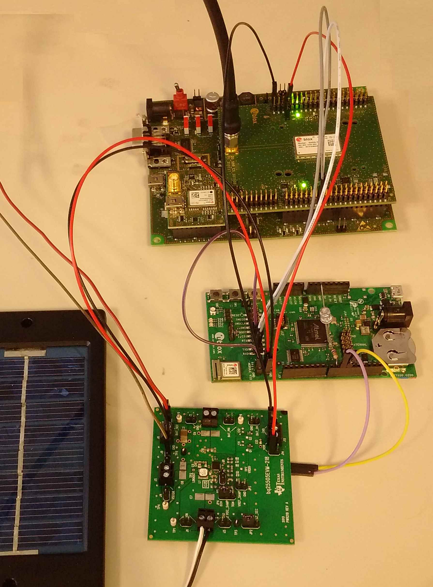

# Introduction
This repo contains Mbed-based software to run on a u-blox NINA-B1 module (e.g. mounted on a `UBLOX_EVK_NINA_B1` Mbed board), written as part of an energy harvesting experiment.

# Hardware
## Configuration
The hardware configuration expected by this software is as follows:
```
                                                                                                ###############################################################
                                                                                                #                                                             #
                                             ####################                               #                    u-blox SARA-N2xx EVK                     #
                                           +-+ Battery/Supercap +-+                             # [Power off, all slide switches off (v), 3V8 jumper removed] #
                                           | #################### |                             #                                                             #
                                           |                      |                     +--------------------------+                                          #
                       +------------------------------------------+                     |       #                  |                                          #
                       |                   |                      |                     |       #           J101  G.  3.  5.  7.  9. 11. ...                  #    \|/
                       |      #############+######################+##############       |       #                 2.  4.  6.  P. 10. 12. ...                  +-----+
                       |      #            G    J8 (VBAT_SEC)     P             #       |       #                              |                              #
           +-----------|------+P                                                #       |  +-----------------------------------+                              #
           |           |      #                TI BQ25505 EVM                   #       |  |    #                                                             #
   ########+########   |      #      [With the track between VBAT_SEC_ON        #       |  |    #                                                             #
   # Energy Source #   |      # J4    and the base of Q1 cut and the two ends   #       |  |    #                                                             #
   ########+########   |      # VIN   exposed through a connector]              #       |  |    #           J104 1.  3.  5.  7.  9. 11. 13.  T.--+  ...       #
           |           |      #                                                 #       |  |    #                2.  4.  6.  8. 10. 12. 14.  R.  |  ...       #
           +-------+---|------+G                                                #       |  |    #                                             |  |            #
                   |   |      #                                       VOR       #       |  |    ##############################################|##|#############
                   |   |      #  VBAT_SEC_ON        Q1_Base        P  J15  G    #       |  |                                                  |  |
                   |   |      ##########+##############+###########+#######+#####       |  |                                                  |  |
                   |   |                |              |           |       |            |  |                                                  |  |
                   |   |   +------------+              |           |       +------------+  |                                                  |  |
                   |   |   |                           |           |                       |                                                  |  |
                   |   |   |   +-----------------------+           +-----------------------+                                                  |  |
                   |   |   |   |                                                                                                              |  |
                   |   |   |   |   +----------------------------------------------------------------------------------------------------------+  |
                   |   |   |   |   |                                                                                                             |
                   |   |   |   |   |   +---------------------------------------------------------------------------------------------------------+
                   |   |   |   |   |   |
                   |   |   |   |   |   |   ################################################################################
                   |   |   |   |   |   |   #                                                                              #
                   |   |   |   |   |   |   #     J9                                                                       #
                   |   |   |   |   |   |   #    .  .                    u-blox NINA-B1 EVK                                #
                   |   |   |   |   |   |   #    .  .         [All jumpers removed, R4 and R6 removed]                     #
                   |   |   |   |   |   |   #    .  .                                                                      #
                   |   |   |   |   |   |   #    .  .                                                                      #
                   |   |   |   |   |   |   #    .  .                                                                      #
                   |   |   |   |   |   |   #    .  .                                                                      #
                   |   |   |   |   |   |   #    .  .                                                                      #
                   |   |   |   |   |   |   # +--.C .                             J7                                       #
                   |   |   |   |   |   +-----|- .T .                            .  .                                      #
                   |   |   |   |   +---------|- .R .                            .  .                                      #
                   |   |   |   |           # |                                  .  .                                      #
                   |   |   |   |           # |   J6  J15                        .  .                                      #
                   |   |   |   |           # |    .   .                         .  .                                      #
                   |   |   |   |           # |    .  P.---+                     .  .                                      #
                   |   |   |   |           # +----.G G.-+ |                                8  9 10 11 12 13  G            #
                   |   |   |   |           #            | |  J3 .  .  .  .  .  .  .  .  J4 .  .  .  .  .  .  .  .  .  .   #
                   |   |   |   |           #            | |                                   |  |  |                     #
                   |   |   |   |           #############|#|###################################|##|##|######################
                   |   |   |   |                        | |                                   |  |  |
                   +---|---|---|------------------------+-|---------- LED ---- 1K Res --------+  |  |
                       |   |   |                          |                                      |  |
                       +---|---|--------------------------+                                      |  |
                           |   |                                                                 |  |
                           +---|-----------------------------------------------------------------+  |
                               |                                                                    |
                               +--------------------------------------------------------------------+
```
In words:

* A TI BQ25505 EVM is connected to an energy source (e.g. a solar panel) and a battery/supercap (e.g. a LiIon coin cell).
* The BQ25505 EVM is modified so that the track running between the `VBAT_SEC_ON` (active low) output of the BQ25505 chip and the base of Q1 is cut and these two lines are made available on a connector.
* On the NINA-B1 EVK R4 and R6 must be removed.
* The NINA-B1 EVK is configured so that only the NINA-B1 module is powered, directly from the battery/supercap to J15, by removing ALL the jumpers.  It will be necessary to add all of the jumpers back onto J9, J7 (for external power), J6 and J15 (both in the upper-most position as viewed in the diagram above) in order to program the NINA-B1 module of course.
* `D9` of the NINA-B1 EVK is a debug output which would normally drive the multi-colour LED on the board but, with all the jumpers removed, should be connected to a debug LED with series resistor.  This is necessary since the NINA-B1 module only has a single serial port which will be connected to the SARA-N2xx module and hence there is no serial port available for debugging.
* `D10` of the NINA-B1 EVK is configured as an input and connected to the `VBAT_SEC_ON` (active low) output of the BQ25505 chip.
* `D11` of the NINA-B1 EVK is configured as an output and used to drive the base of Q1 on the TI BQ25505 EVM board (hence controlling whether `VOR` is on or not).
* A u-blox SARA-N2xx EVK is configured so that all of the lower board is off (the lower board is still necessary as the SIM card holder is on the lower board): main power toggle switch is off, all slide switches are off (i.e. on the side towards the middle of the board) and the 3V8 jumper on the lower board (near the SIM) is removed.  Power is then applied directly to the module by connecting `VOR` from the TI BQ25505 EVM to any one of pins 7, 8, 9 or 10 of J101 (ground is pin 1 on both J101 and J104).
* The serial lines from the NINA-B1 module are connected to the SARA-N2xx module's serial lines and the CTS line of the NINA-B1 module is connected to ground (not sure if this is required or not).

In pictures:



## Volts
When setting this up I had a lot of problems with the reliability of serial comms between the NINA-B1 module and the SARA-N2xx EVK.

The NINA-B1 module operates its IO pins at whatever voltage is supplied at its VCC pin (the somewhat tempting VCC_IO pin on the module is internally connected to VCC).  The SARA-N2xx EVK includes level shifters that take the 3.3 Volt IO from the SARA-N2xx module down to 1.8 Volts; there are no headers giving access to the IO pins directly.  While it is theoretically possible to power the NINA-B1 from 1.8 Volts, this doesn't seem to work on the NINA-B1 EVK board; at least 2.5 Volts seemed to be required on the J15 centre pin to make it run.  By experiment, the only arrangement where serial comms worked reliably was with NINA-B1 powered from 3.3 Volts.  So in order to use these boards as-is, a DC to DC converter has to be used between the battery/supercap and the NINA-B1 EVK board in order to supply it with 3.3 Volts.  This issue will go away when we use properly hacked HW rather than off the shelf boards.

# Software
## Introduction
The software is based upon [mbed-os-example-ble/BLE_Button](https://github.com/ARMmbed/mbed-os-example-ble/tree/master/BLE_Button) but with the BLE portions compiled-out; they may be used in the future.

## Components
This software includes copies of the [UbloxCellularBaseN2xx](https://os.mbed.com/teams/ublox/code/ublox-cellular-base-n2xx/) and [UbloxATCellularInterfaceN2xx](https://os.mbed.com/teams/ublox/code/ublox-at-cellular-interface-n2xx/) drivers, rather than linking to the original libraries.  This is so that the drivers can be modified to add a configurable time-out to the network registration process.

NOTE: the code overrides the functions `mbed_error_vfprintf()` in `mbed-os/platform/mbed_board.c` and `mbed_assert_internal()` in `mbed-os/platform/mbed_assert.c`(so that Mbed asserts can be exposed).  To permit this you will need to edit `mbed-os/platform/mbed_board.c` so that:

`void mbed_error_vfprintf(const char * format, va_list arg)`

...becomes:

`WEAK void mbed_error_vfprintf(const char * format, va_list arg)`

...and edit `mbed-os/platform/mbed_assert.c` so that:

`void mbed_assert_internal(const char *expr, const char *file, int line)`

...becomes:

```
#include "platform/mbed_toolchain.h"
WEAK void mbed_assert_internal(const char *expr, const char *file, int line)
```

## Operation
The NINA-B1 software spends most of its time asleep, where the current consumption is ~0.3 uAmps.  It powers-up periodically and checks the `VBAT_SEC_ON` line; if that line is low (meaning that there is sufficient power in the battery/supercap), it powers up the SARA-N2xx module, which registers with the cellular network, and transmits whatever data it has before putting everything back to sleep once more.

As a video (the action begins 16 seconds in):

<a href="http://www.youtube.com/watch?feature=player_embedded&v=HQhBW8Z5sNg" target="_blank"></a>

## Debugging
With only GPIO-based debugging, there are two ways to monitor what is going on in this code:

1.  Monitor the serial lines for AT command activity (I used a Saleae box for this since the box can do very long term captures and will automagicaly decode the serial protocol).
2.  Use the `printfMorse()` function that will flash the debug LED based on your strings.

When using `printfMorse()` the start and end of a Morse sequence is signalled by a rapid flash on the LED.  Remember to keep your Morse strings short as they will take a while to come out.  The `printfMorse()` function blocks and there is also a `tPrintfMorse()` function which allows the rest of the code to run but will mask any use of the debug LED while it is active.

Here is a video of a sample of this Morse sequence:

<a href="http://www.youtube.com/watch?feature=player_embedded&v=8VpEXieqOn8" target="_blank"></a>

A good Morse chart can be found on [Wikipedia](https://en.wikipedia.org/wiki/Morse_code#/media/File:International_Morse_Code.svg).