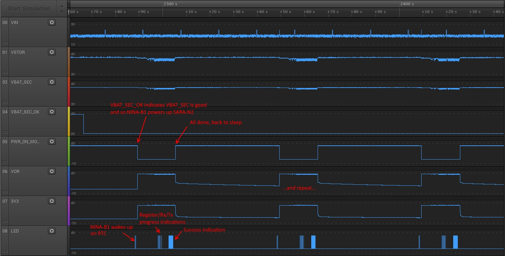

# Introduction
This repo contains Mbed-based software to run on a u-blox NINA-B1 module (e.g. mounted on a `UBLOX_EVK_NINA_B1` Mbed board), written as part of an energy harvesting experiment.

# Hardware
## Configuration
The hardware configuration expected by this software is as follows:
```
                                                                                                ###############################################################
                                                                                                #                                                             #
                                             ####################                               #                    u-blox SARA-N2xx EVK                     #
                                           +-+ Battery/Supercap +-+                             # [Power off, all slide switches off (v), 3V8 jumper removed] #
                                           | #################### |                             # NOTE: it is also possible to use SARA-R410M, see text below.#
                                           |                      |                     +--------------------------+                                          #
                       +------------------------------------------+                     |       #                  |                                          #
                       |                   |                      |                     |       #           J101  G.  3.  5.  7.  9. 11. ...                  #    \|/
                       |      #############+######################+##############       |       #                 2.  4.  6.  P. 10. 12. ...                  +-----+
                       |      #            G    J8 (VBAT_SEC)     P             #       |       #                              |                              #
           +-----------|------+P                                                #       |  +-----------------------------------+                              #
           |           |      #                TI BQ25505 EVM                   #       |  |    #                                                             #
   ########+########   |      #      [With the track between VBAT_SEC_ON        #       |  |    #                                                             #
   # Energy Source #   |      # J4    and the base of Q1 cut and the two ends   #       |  |    #                                                             #
   ########+########   |      # VIN   exposed through a connector and R6/R7/R8  #       |  |    #           J104 1.  3.  5.  7.  9. 11. 13.  T.--+  ...       #
           |           |      #       modified appropriately (see text)]        #       |  |    #                2.  4.  6.  8. 10. 12. 14.  R.  |  ...       #
           +-------+---|------+G                                                #       |  |    #                                             |  |            #
                   |   |      #                                       VOR       #       |  |    ##############################################|##|#############
                   |   |      #  VBAT_SEC_ON        Q1_Base        P  J15  G    #       |  |                                                  |  |
                   |   |      ##########+##############+###########+#######+#####       |  |                                                  |  |
                   |   |                |              |           |       |            |  |                                                  |  |
                   |   |   +------------+              |           |       +------------+  |                                                  |  |
                   |   |   |                           |           |                       |                                                  |  |
                   |   |   |   +-----------------------+           +-----------------------+                                                  |  |
                   |   |   |   |                                                                                                              |  |
                   |   |   |   |   +----------------------------------------------------------------------------------------------------------+  |
                   |   |   |   |   |                                                                                                             |
                   |   |   |   |   |   +---------------------------------------------------------------------------------------------------------+
                   |   |   |   |   |   |
                   |   |   |   |   |   |   ################################################################################
                   |   |   |   |   |   |   #                                                                              #
                   |   |   |   |   |   |   #     J9                                                                       #
                   |   |   |   |   |   |   #    .  .                    u-blox NINA-B1 EVK                                #
                   |   |   |   |   |   |   #    .  .         [All jumpers removed, R4 and R6 removed]                     #
                   |   |   |   |   |   |   #    .  .                                                                      #
                   |   |   |   |   |   |   #    .  .                                                                      #
                   |   |   |   |   |   |   #    .  .                                                                      #
                   |   |   |   |   |   |   #    .  .                                                                      #
                   |   |   |   |   |   |   #    .  .                                                                      #
                   |   |   |   |   |   |   # +--.C .                             J7                                       #
                   |   |   |   |   |   +-----|- .T .                            .  .                                      #
                   |   |   |   |   +---------|- .R .                            .  .                                      #
                   |   |   |   |           # |                                  .  .                                      #
                   |   |   |   |           # |   J6  J15                        .  .                                      #
                   |   |   |   |           # |    .   .                         .  .                                      #
                   |   |   |   |           # |    .  P.---+                     .  .                                      #
                   |   |   |   |           # +----.G G.-+ |                                8  9 10 11 12 13  G            #
                   |   |   |   |           #            | |  J3 .  .  .  .  .  .  .  .  J4 .  .  .  .  .  .  .  .  .  .   #
                   |   |   |   |           #            | |                                   |  |  |  |     |            #
                   |   |   |   |           #############|#|###################################|##|##|######################
                   |   |   |   |                        | |                                   |  |  |  |     |
                   +---|---|---|------------------------+-|---------- LED ---- 1K Res --------+  |  |  +-----+
                       |   |   |                          |                                      |  |
                       +---|---|--------------------------+                                      |  |
                           |   |                                                                 |  |
                           +---|-----------------------------------------------------------------+  |
                               |                                                                    |
                               +--------------------------------------------------------------------+
```
In words:

* A TI BQ25505 EVM is connected to an energy source (e.g. a solar panel) and a battery/supercap (e.g. a LiIon coin cell).
* The BQ25505 EVM is modified so that the track running between the `VBAT_SEC_ON` (active low) output of the BQ25505 chip and the base of Q1 is cut and these two lines are made available on a connector.
* On the NINA-B1 EVK R4 and R6 must be removed.
* The NINA-B1 EVK is configured so that only the NINA-B1 module is powered, directly from the battery/supercap to J15, by removing ALL the jumpers.  It will be necessary to add all of the jumpers back onto J9, J7 (for external power), J6 and J15 (both in the upper-most position as viewed in the diagram above) in order to program the NINA-B1 module of course.
* `D9` of the NINA-B1 EVK is a debug output which would normally drive the multi-colour LED on the board but, with all the jumpers removed, should be connected to a debug LED with series resistor.  This is necessary since the NINA-B1 module only has a single serial port which will be connected to the SARA-N2xx module and hence there is no serial port available for debugging.
* `D10` of the NINA-B1 EVK is configured as an input and connected to the `VBAT_SEC_ON` (active low) output of the BQ25505 chip.
* `D11` of the NINA-B1 EVK is configured as an output and used to drive the base of Q1 on the TI BQ25505 EVM board (hence controlling whether `VOR` is on or not).
* `D12` of the NINA-B1 EVK must be connected to GND.
* A u-blox SARA-N2xx EVK is configured so that all of the lower board is off (the lower board is still necessary as the SIM card holder is on the lower board): main power toggle switch is off, all slide switches are off (i.e. on the side towards the middle of the board) and the 3V8 jumper on the lower board (near the SIM) is removed.  Power is then applied directly to the module by connecting `VOR` from the TI BQ25505 EVM to any one of pins 7, 8, 9 or 10 of J101 (ground is pin 1 on both J101 and J104).
* The serial lines from the NINA-B1 module are connected to the SARA-N2xx module's serial lines and the CTS line of the NINA-B1 module is connected to ground.

In pictures:


## Setting Up The TI BQ25505 EVM
As shipped, R6/R7/R8 (ROK3/ROK2/ROK1) are 887k/6.98M/5.36M respectively.  These are the resistors that set the thresholds and hysteresis of `VBAT_OK`, and hence `VBAT_SEC_ON`.  From the [spreadsheet](docs/bq25505_Design_Help_V1_3.xlsx) provided by TI these values equate to 2.7 Volts/3 Volts, which is a bit odd to say the least and entirely unsuitable for the 3.7 Volt LiPo cell I wanted to connect to `VBAT_SEC`.  I bought a range of 0603 SMD 1% tolerance resistors in > 1 MOhm values and, using the spreadsheet, I selected values of 1.43M/7.5M/4.22M respectively to give me 3.3 Volts/3.8 Volts.

## Volts
When setting this up I had a lot of problems with the reliability of serial comms between the NINA-B1 module and the SARA-N2xx EVK.

The NINA-B1 module operates its IO pins at whatever voltage is supplied at its VCC pin (the somewhat tempting VCC_IO pin on the module is internally connected to VCC).  The SARA-N2xx EVK includes level shifters that take the 3.3 Volt IO from the SARA-N2xx module down to 1.8 Volts; there are no headers giving access to the IO pins directly.  It is possible to power the NINA-B1 from 1.8 Volts but this means the Arduino IO lines run at the same levels and it turns out that 1.8 Volts on the FET that controls VOR on the TI BQ25505 EVM is not enough to switch it off, hence power remains applied to the SARA-N2xx module all the time (also you can't flash a debug LED from 1.8 Volts).  Hence, for the purposes of this experiment, a couple of [ISL9120 high efficiency DC-DC converter evaluation boards](https://www.intersil.com/en/tools/reference-designs/isl9120iix-evz.html) were purchased.  These were used to supply power to the NINA-B1 and the SARA-N2xx modules at a guaranteed voltage level.

## Using a SARA-R410M EVK
Instead of using a SARA-N2xx EVK, it is possible to use a SARA-R410M EVK, though note that this is NOT yet fully tested:

* In your head, convert `J101` to `J300` and `J104` to `J301`.
* Power and serial connections remain the same (pin 8 on `J300` for VCC and pins 15/16 on `J301` for Tx/Rx) but power must now be 3.8 Volts (3.3 Volts is NOT enough).
* In addition, connect the following:
    * pin `A5` on the NINA-B1 EVK to pin 29 of `J301` (PWR_ON),
    * pin `A4` on the NINA-B1 EVK to pin 26 of `J300` (RESET_N).
* Remove the grounding of pin `D12` of the NINA-B1 EVK.

When, at power-on, the software running on NINA-B1 detects that pin `D12` of the NINA-B1 EVK has been allowed to float high, it will assume that a SARA-R410M EVK has been connected instead of a SARA-N2xx EVK and will drive that module appropriately.

# Software
## Introduction
The software is based upon [mbed-os-example-ble/BLE_Button](https://github.com/ARMmbed/mbed-os-example-ble/tree/master/BLE_Button) but with the BLE portions compiled-out; they may be used in the future.

## Components
This software includes copies of the [UbloxCellularBaseN2xx](https://os.mbed.com/teams/ublox/code/ublox-cellular-base-n2xx/)/[UbloxATCellularInterfaceN2xx](https://os.mbed.com/teams/ublox/code/ublox-at-cellular-interface-n2xx/) (for SARA-N2xx) and [UbloxCellularBase](https://os.mbed.com/teams/ublox/code/ublox-cellular-base/)/[UbloxATCellularInterface](https://os.mbed.com/teams/ublox/code/ublox-at-cellular-interface/) (for SARA-R410M) drivers, rather than linking to the original libraries.  This is so that the drivers can be modified to add a configurable time-out to the network registration process and to employ release assistance (saving power).

NOTE: if you define `ENABLE_ASSERTS_IN_MORSE` the code overrides the functions `mbed_error_vfprintf()` in `mbed-os/platform/mbed_board.c` and `mbed_assert_internal()` in `mbed-os/platform/mbed_assert.c` so that Mbed asserts can be exposed through `printfMorse()`.  To permit this you will need to edit `mbed-os/platform/mbed_board.c` so that:

`void mbed_error_vfprintf(const char * format, va_list arg)`

...becomes:

`WEAK void mbed_error_vfprintf(const char * format, va_list arg)`

...and edit `mbed-os/platform/mbed_assert.c` so that:

`void mbed_assert_internal(const char *expr, const char *file, int line)`

...becomes:

```
#include "platform/mbed_toolchain.h"
WEAK void mbed_assert_internal(const char *expr, const char *file, int line)
```

## Operation
The NINA-B1 software spends most of its time asleep, where the current consumption averages ~1.2 uAmps.  It powers-up every 60 seconds and checks the `VBAT_SEC_ON` line; if that line is low (meaning that there is sufficient power in the battery/supercap), it powers up the SARA-N2xx/SARA-R410M module, which registers with the cellular network, and transmits whatever data it has before putting everything back to sleep once more.

As a video (the action begins 16 seconds in):

<a href="http://www.youtube.com/watch?feature=player_embedded&v=HQhBW8Z5sNg" target="_blank"></a>

Here is a photograph of a fully configured rig which uses the tiny [IXYS SLMD121H04L](docs/slmd121h04l_nov16.pdf) solar panel with a 100 Watt warm light LED bulb above it and a 150 mWh LiPo (the kind of thing used in small drones) as `VBAT_SEC`.  There are two 3.3 Volt regulators in circuit in order to allow use of a standard SARA-N2xx EVK board with its voltage conversions and there's an LED on the NINA-B1 board (and quite a lot of associated SW delays) in order to see what's going on.  The SARA-N2xx module has a cabled RF connection to an NBIoT network and so is in perfect coverage.


When this kit was left to run over a 16 hour period with a Saleae logic probe attached to the interesting points you can clearly see it behaved well, being able to run a 60 second cycle of register with the NBIoT network, transmit a [48 byte] UDP packet and receive a [48 byte] UDP packet, for 36% of the time:


Here are some detailed views of the start and end of an "active" period (i.e. when `VBAT_SEC_ON` is low):




Clearly these are beyond optimum conditions (24 hour midday sun and perfect cellular coverage) but a 36% active time is a *very* long way above expectations and this HW is also most definitely not optimised.

## Debugging
With only GPIO-based debugging (the single serial port from the NINA-B1 module being connected to the SARA-N2xx/SARA-R410M module), there are two ways to get debug text out of this code:

1.  Monitor the serial lines for AT command activity (I used a Saleae box for this since the box can do very long term captures and will automagicaly decode the serial protocol).
2.  Use the `printfMorse()` function that will flash the debug LED based on `printf()`-style strings.

When using `printfMorse()` the start and end of a Morse sequence is signalled by a rapid flash on the LED.  Remember to keep your Morse strings short as they will take a while to come out.  The `printfMorse()` function blocks but there is also a `tPrintfMorse()` function which runs in its own task, allowing the rest of the code to run (but masking any other use of the debug LED while it is active).

Here is a video of a sample Morse sequence:

<a href="http://www.youtube.com/watch?feature=player_embedded&v=8VpEXieqOn8" target="_blank"></a>

A good Morse chart can be found on [Wikipedia](https://en.wikipedia.org/wiki/Morse_code#/media/File:International_Morse_Code.svg).